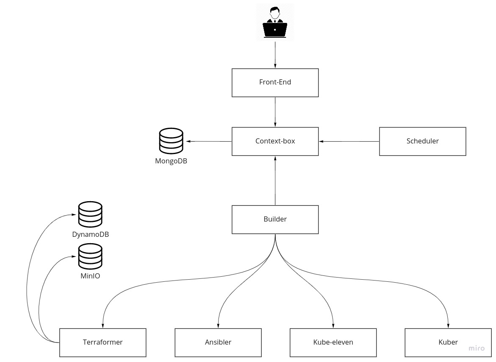

# Claudie
### Single platform for multiple clouds



### Microservices
- [Context-box](https://github.com/Berops/claudie/tree/master/services/context-box)
- [Scheduler](https://github.com/Berops/claudie/tree/master/services/scheduler)
- [Builder](https://github.com/Berops/claudie/tree/master/services/builder)
- [Terraformer](https://github.com/Berops/claudie/tree/master/services/terraformer)
- [Ansibler](https://github.com/Berops/claudie/tree/master/services/ansibler)
- [Kube-eleven](https://github.com/Berops/claudie/tree/master/services/kube-eleven)
- [Kuber](https://github.com/Berops/claudie/tree/master/services/kuber)
- [Frontend](https://github.com/Berops/claudie/tree/master/services/frontend)

### Data stores
- [MongoDB](https://github.com/Berops/claudie/tree/master/manifests/claudie/mongo)
- [Minio](https://github.com/Berops/claudie/tree/master/manifests/claudie/minio)

### Tools used
- [Terraform](https://github.com/hashicorp/terraform)
- [Ansible](https://github.com/ansible/ansible)
- [KubeOne](https://github.com/kubermatic/kubeone)
- [Longhorn](https://github.com/longhorn/longhorn)
- [Nginx](https://www.nginx.com/)
- [Calico](https://github.com/projectcalico/calico)
- [K8s-sidecar](https://github.com/kiwigrid/k8s-sidecar)
- [gRPC](https://grpc.io/)


## Context-box
Context box is "control unit" for the Claudie. It holds pending configs, which needs to be processed, periodically checks for the new/changed configs and receives new configs from `frontend`.

### API

```go
  //Save config parsed by Frontend
  rpc SaveConfigFrontEnd(SaveConfigRequest) returns (SaveConfigResponse);
  //Save config parsed by Scheduler
  rpc SaveConfigScheduler(SaveConfigRequest) returns (SaveConfigResponse);
  //Save config parsed by Builder
  rpc SaveConfigBuilder(SaveConfigRequest) returns (SaveConfigResponse);
  //Get single config from database
  rpc GetConfigFromDB(GetConfigFromDBRequest) returns (GetConfigFromDBResponse);
  // *(NEEDS DELETION)*
  rpc GetConfigByName(GetConfigByNameRequest) returns (GetConfigByNameResponse);
  //Get config from scheduler queue of pending configs
  rpc GetConfigScheduler(GetConfigRequest) returns (GetConfigResponse);
  //Get config from builder queue of pending configs
  rpc GetConfigBuilder(GetConfigRequest) returns (GetConfigResponse);
  //Get all configs from database
  rpc GetAllConfigs(GetAllConfigsRequest) returns (GetAllConfigsResponse);
  // Sets the manifest to null which forces the deletion of the infra,
  // defined by the manifest, next time when the config will be picked up.
  rpc DeleteConfig(DeleteConfigRequest) returns (DeleteConfigResponse);
  // Deletes config from database.
  rpc DeleteConfigFromDB(DeleteConfigRequest) returns (DeleteConfigResponse);
```
### Flow

- Receives config file from Frontend calculates `msChecksum` and saves it to the database
- Periodically push config where `msChecksum` != `dsChecksum` to the schedulerQueue
- Periodically push config where `dsChecksum` != `csChecksum` to the builderQueue
- Receives config with desiredState from Scheduler
- Checks if `dsChecksum` == `msChecksum`
    - `true` -> saves it to the database
    - `false` -> it ignores this config
- Receives config with currentState from Builder and saves it to the database
- Checks if `csChecksum` == `dsChecksum`
    - `true` -> saves it to the database
    - `false` -> it ignores this config

##### `msChecksum` - manifest checksum
##### `dsChecksum` - desired state checksum
##### `csChecksum` - current state checksum


## Scheduler
Scheduler creates desired state of the infra based on the manifest taken from the config received from Context-box.

Scheduler also monitors health of the current infra and manages any operations based on it, e.g. replacement of broken node, etc. *[work in progress]*

### API
```
This service is gRPC client, thus it does not provide any API
```

### Flow
- Periodically pulls `config` from Context-Box's `schedulerQueue`
- Creates desiredState with `dsChecksum` from config
- Sends `config` file back to Context-box


## Builder
Builder aligns the current state of the infrastructure with the desired state. It calls methods on `terraformer`, `ansibler`, `kube-eleven` and `kuber` in order to manage the infrastructure. Builder also takes care of deleting nodes from kubernetes cluster by finding difference between `desiredState` and `currentState`.

### API
```
This service is gRPC client, thus it does not provide any API
```

### Flow
- Periodically pulls `config` from Context-Box's `builderQueue`
- Calls Terraformer, Ansibler, Kube-eleven and Kuber
- Creates `currentState`
- Sends updated config with `currentState` to Context-box


## Terraformer
Terraformer creates or destroys infra specified in the desired state via terraform calls. 

### API
```go
  //Builds the infrastructure based on the provided desired state (includes addition/deletion of stuff)
  rpc BuildInfrastructure(BuildInfrastructureRequest) returns (BuildInfrastructureResponse);
  //Destroys the infrastructure completely
  rpc DestroyInfrastructure(DestroyInfrastructureRequest) returns (DestroyInfrastructureResponse);
```

### Flow
- Receives `config` from Builder
- Uses Terraform to create an infrastructure from `desiredState`
- Updates `currentState` in a `config`
- On infra deletion, destroys the infra based on the current state

## Ansibler
Ansibler uses Ansible to set up:
  - Wireguard VPN between the nodes
  - nginx loadbalancer
  - installs dependencies for nodes in kubernetes cluster

### API

```go
  //InstallNodeRequirements installs any requirements there are on all of the nodes
  rpc InstallNodeRequirements(InstallRequest) returns (InstallResponse);
  //InstallVPN installs VPN between nodes in the k8s cluster and lb clusters
  rpc InstallVPN(InstallRequest) returns (InstallResponse);
  //SetUpLoadbalancers sets up the loadbalancers, DNS and verifies their configuration
  rpc SetUpLoadbalancers(SetUpLBRequest) returns (SetUpLBResponse);
```

### Flow
- Receives `config` from Builder for `InstallVPN()`
  - Sets up the ansible inventory, and installs the Wireguard full mesh VPN via playbook
  - Updates `currentState` in a `config`
- Receives `config` from Builder for `InstallNodeRequirements()`
  - Sets up the ansible inventory, and install any requirements nodes in the infra might need
  - Updates `currentState` in a `config`
- Receives `config` from Builder for `SetUpLoadbalancers()`
  - Sets up the ansible inventory, and installs nginx loadbalancers
  - Creates and verifies the DNS configuration for the loadbalancers


## Kube-eleven
Kube-eleven uses kubeOne to set up kubernetes clusters. If the cluster was build, it assures the cluster is healthy and running as it should.

### API
```go
  //BuildCluster will build the kubernetes clusters as specified in provided config
  rpc BuildCluster(BuildClusterRequest) returns (BuildClusterResponse);
```

### Flow
- Receives `config` from Builder
- Generates kubeOne manifest from `desiredState`
- Uses kubeOne to provision kubernetes cluster
- Updates `currentState` in a `config`

## Kuber
Kuber manipulates the cluster resources using `kubectl`.

### API
```go
  //SetUpStorage installs Longhorn into the cluster
  rpc SetUpStorage(SetUpStorageRequest) returns (SetUpStorageResponse); 
  //StoreKubeconfig will create a secret which holds kubeconfig of the Claudie created cluster
  rpc StoreKubeconfig(StoreKubeconfigRequest) returns (StoreKubeconfigResponse);
  //DeleteKubeconfig will remove a secret that holds kubeconfig of Claudie created cluster
  rpc DeleteKubeconfig(DeleteKubeconfigRequest) returns (DeleteKubeconfigResponse);
  //DeleteNodes will delete specified nodes from a specified k8s cluster
  rpc DeleteNodes(DeleteNodesRequest) returns (DeleteNodesResponse);
```

### Flow
- Receives `config` from Builder for `SetUpStorage()`
- Applies longhorn deployment
- Receives `config` from Builder for `StoreKubeconfig()`
- Create a kubernetes secret which holds kubeconfig of the Claudie created cluster
- On infra deletion, deletes the secret which holds kubeconfig of deleted cluster

## Frontend
Frontend is a layer between user and the Claudie. 
The new manifests are added as a secret into the kubernetes cluster where, `k8s-sidecar` will save them into the Frontends file system
and notify the frontend service via HTTP request that new manifests are available.

### API
```
This service is gRPC client, thus it does not provide any API
```

### Flow
- User applies new secret holding a manifest
- `k8s-sidecar` will detect it and save it to the Frontend's file system
- `k8s-sidecar` notifies frontend via HTTP request that changes have been made
- Frontend detects new manifest and saves it to the database
- On deletion of user created secret, Frontend initiates deletion process of the manifest