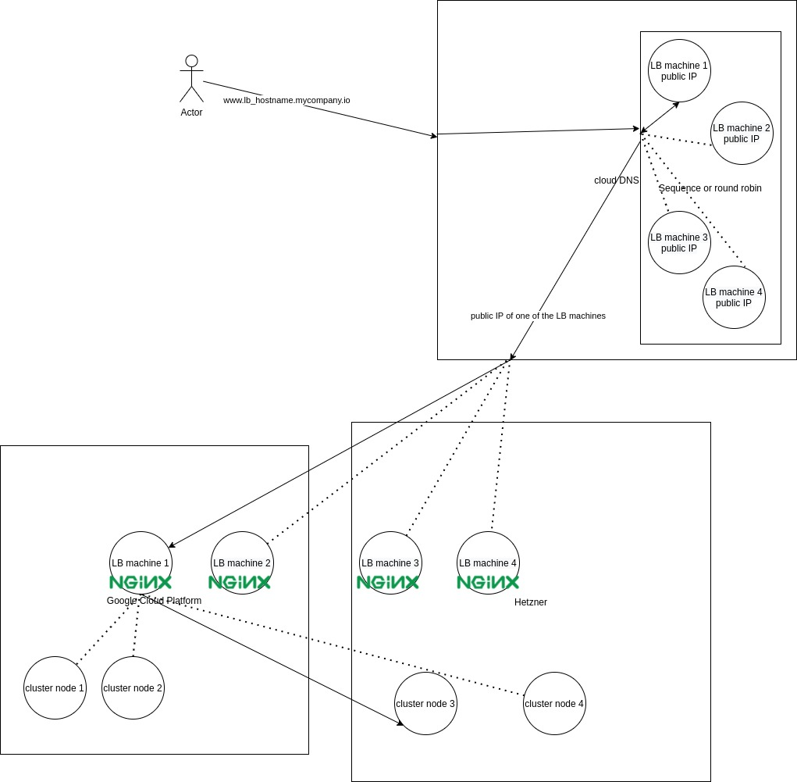

# Claudie Loadbalancer proposal

## Example diagram



## Requirements

- 1 or more virtual machines (LB machines), either on-premises, or via 1 on more cloud providers.
- LB machines must have public IP addresses
    - Cloud provider LB machines are provisioned by Claudie with their own public IP address
    - On-premises LB machines are already expected to exist with their own public IP address

## Concept

- The machines will join the Wireguard private network of Claudie clusters relevant to it
  - This is necessary so that the LB machines can send traffic to the cluster machines over the `wireguard VPN`
  
- DNS A records will be created and managed by Claudie on 1 or more cloud providers
  - There will be a DNS A record for the public IP of each LB machine that is currently passing the health checks

- The LB machines will run an `Nginx` to carry out the actual load balancing.
  - There will be a DNS A record for the public IP of each LB machine that is currently passing the health checks
  - Therefore, there will be actually 2 layers of load balancing 
    1. DNS-based load balancing to determine the LB machine to be used 
    2. Software load balancing on the chosen LB machine. 

- Claudie will dynamically manage the LB configuration, e.g. if some cluster node is removed, the LB configuration changes or DNS configuration changes (hostname change)

- The load balancing will be on L4 layer, TCP/UDP, partially configurable by the Claudie input manifest

- Note that a pure `on-premises` DNS managed via Claudie is not going to be supported
  - But if the client wants, they can manually create a DNS record for their LB VM public IP addresses, outside Claudie

# Example input manifest for LB
```yaml
loadBalancers:
  - name: dev-apiserver # loadbalancer name
    clusterName: test-cluster-name1 # name of the cluster associated with this loadbalancer
    dns:
      hostname: www.dev-apiserver.mycompany.io
      providers: # which cloud providers to use for creating the DNS A records
        - provider:
            name: gcp
            credentials: "{}"
        - provider:
            name: hetzner
            credentials: abcd1234
    roles:
      - apiserver # automatically configure the LB to forward TCP 6443 to the master nodes. Also useful for helping Claudie choose optimal kubelet configuration.
    nodePools:
      - name: gcp
        provider:
          name: gcp
          credentials: "{}"
        region: europe-west1
        machine:
          - count: 1
            # shape: small
            server_type: e2-small
            image: ubuntu-os-cloud/ubuntu-2004-lts
            disk_size: 50
            zone: europe-west1-c
      - name: hetzner
        provider:
          name: hetzner
          credentials: abcd1234
        machine:
          - count: 1
            # shape: small
            server_type: cpx11
            image: ubuntu-20.04
            disk_size: 50
            location: nbg1
            datacenter: nbg1-dc3
  - name: dev-app # loadbalancer name
    clusterName: test-cluster-name1 # name of the cluster associated with this loadbalancer
    dns:
      hostname: www.dev-app.mycompany.io
      providers:
        - provider:
            name: gcp
            credentials: "{}"
        - provider:
            name: hetzner
            credentials: abcd1234
    conf:
      - name: ingress_http
        protocol: tcp # TCP, UDP, or both
        port: 80
        targetPort: 32080
        targetNodePools:
          - nodePoolName: hetzner-workers
          - nodePoolName: gcp-workers
      - name: ingress_https
        protocol: tcp # TCP, UDP, or both
        port: 443
        targetPort: 32443
        targetNodePools:
          - nodePoolName: hetzner-workers
          - nodePoolName: gcp-workers
      - name: mysql
        protocol: tcp # TCP, UDP, or both
        port: 3306
        targetPort: 33306
        targetNodePools:
          - nodePoolName: hetzner-workers
          - nodePoolName: gcp-workers
    nodePools: # note that this can have the same structure as nodepools defining the clusters, as long as we're smart about it
      - name: gcp
        provider:
          name: gcp
          credentials: "{}"
        region: europe-west1
        machine:
          - count: 1
            # shape: small
            server_type: e2-small
            image: ubuntu-os-cloud/ubuntu-2004-lts
            disk_size: 50
            zone: europe-west1-c
      - name: hetzner
        provider:
          name: hetzner
          credentials: abcd1234
        machine:
          - count: 1
            # shape: small
            server_type: cpx11
            image: ubuntu-20.04
            disk_size: 50
            location: nbg1
            datacenter: nbg1-dc3
```